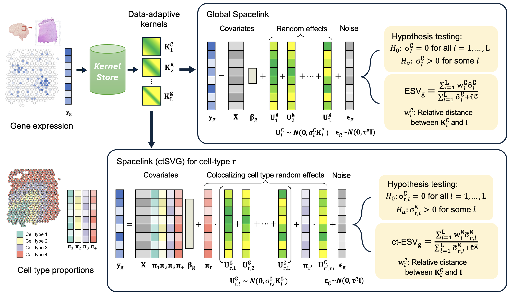

<!-- README.md is generated from README.Rmd. Please edit that file -->

# spacelink

<!-- badges: start -->
<!-- badges: end -->



`spacelink` is a unified statistical framework for detecting and
prioritizing SVGs at both global tissue and cell-type resolution.
Spacelink employs an adaptive multi-kernel model to capture spatial
variance across diverse length scales, and its cell-type specific
version introduces a data-driven gating strategy to correct for spatial
colocalization, designed to improve the specificity for cell types that
are weakly represented in mixed spots relative to more abundant
colocalizing cell types. To summarize spatial variability, we define
Effective Spatial Variability (ESV), a metric which integrates variance
magnitude of each component kernel and its corresponding spatial scale
into a single interpretable score directly suited for genetic analyses.

## Installation

You can install the development version of spacelink from
[GitHub](https://github.com/) with:

``` r
# install.packages("devtools")
devtools::install_github("xueweic/spacelink")
```

## Tutorial

A detailed tutorial is available
[here](https://xueweic.github.io/spacelink/index.html).
