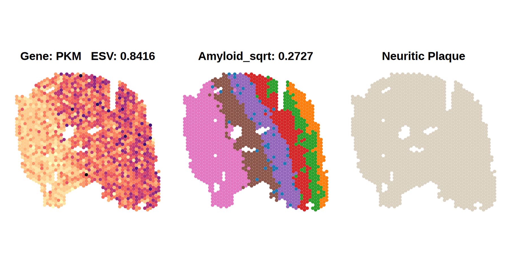
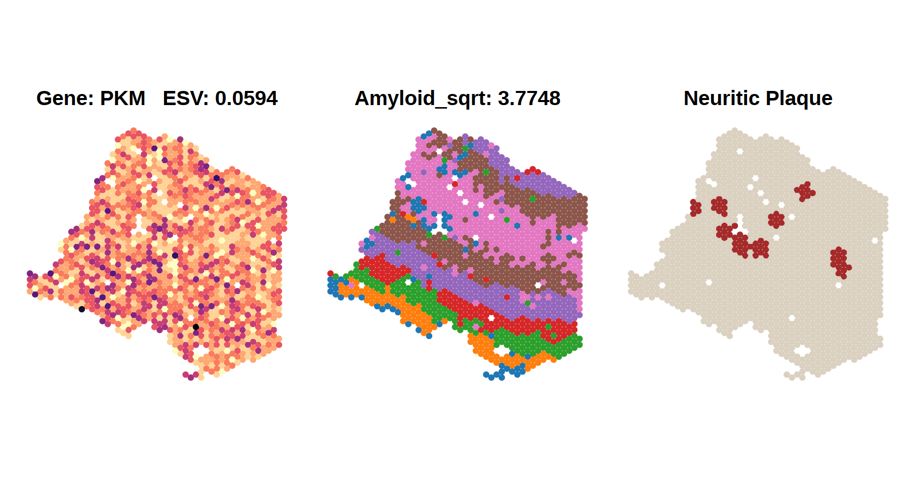

```{r, include = FALSE}
knitr::opts_chunk$set(
  collapse = TRUE,
  comment = "#>",
  fig.path = "figures/",
  out.width = "100%"
)
```

# Application of Spacelink to Visium Human DLPFC Samples across AD Progression Stages

In this vignette, we apply Spacelink to Visium DLPFC samples from donors at different stages of Alzheimer's Disease (AD) to demonstrate that Spacelink can effectively capture spatial patterns of gene expression associated with AD pathological features.

The data used here consists of 32 ROSMAP 10x Visium samples from brain dorsolateral prefrontal cortex (DLPFC) at different stages of Alzheimer's disease (AD), which is available at [link](https://adknowledgeportal.org).

For simplicity, here we analyze *PKM* gene expression in one control sample and one late-stage AD sample.
*PKM* is a key glycolysis enzyme that may be affected by metabolic dysfunction in early AD.

## 1. Load Packages

```{r eval=FALSE}
library(SpatialExperiment) 
library(Seurat)
library(dplyr)
library(ggplot2)
library(viridis)
library(patchwork)
library(spacelink) 
```

## 2. Load Example Dataset

We use one control sample and one late-stage AD sample.

```{r eval=FALSE}
control_spe <- readRDS("50500136_1.rds")
control_counts <- as.matrix(counts(control_spe))
control_spatial_coords <- as.data.frame(spatialCoords(control_spe))

AD_spe <- readRDS("18414513_1.rds")
AD_counts <- as.matrix(counts(AD_spe))
AD_spatial_coords <- as.data.frame(spatialCoords(AD_spe))

dim(control_counts)
```

```{r eval=FALSE}
## [1] 36601  1663
```

```{r eval=FALSE}
dim(AD_counts)
```

```{r eval=FALSE}
## [1] 36601  1273
```

## 3. Preprocessing

Before running the analysis, we remove mitochondrial genes and genes that are expressed in very few spots (less than 0.5%).
Also, we normalize the counts using [SCTransform](https://satijalab.org/seurat/reference/sctransform).

```{r eval=FALSE}
control_counts <- control_counts[!grepl("(^MT-)|(^mt-)", rownames(control_counts)),]
control_counts <- control_counts[apply(control_counts >= 3, 1, sum) >= ncol(control_counts)*0.005,]
seurat_obj <- CreateSeuratObject(counts = control_counts)
seurat_norm = SCTransform(seurat_obj, vst.flavor = "v2", verbose = FALSE)
control_normalized_counts <- seurat_norm@assays$SCT$data

AD_counts <- AD_counts[!grepl("(^MT-)|(^mt-)", rownames(AD_counts)),]
AD_counts <- AD_counts[apply(AD_counts >= 3, 1, sum) >= ncol(AD_counts)*0.005,]
seurat_obj <- CreateSeuratObject(counts = AD_counts)
seurat_norm = SCTransform(seurat_obj, vst.flavor = "v2", verbose = FALSE)
AD_normalized_counts <- seurat_norm@assays$SCT$data

dim(control_normalized_counts)
```

```{r eval=FALSE}
## [1] 6825  1663
```

```{r eval=FALSE}
dim(AD_normalized_counts)
```

```{r eval=FALSE}
## [1] 4228  1273
```


## 4. Run Global Spacelink

We compute the Effective Spatial Variability (ESV) score for the *PKM* gene in each sample.
A higher ESV indicates stronger spatial patterning of expression across tissue spots.

```{r eval=FALSE}
# Ensembl ID of PKM: ENSG00000067225
spacelink_results <- spacelink(control_normalized_counts['ENSG00000067225',],control_spatial_coords)
control_ESV = spacelink_results$ESV

spacelink_results <- spacelink(AD_normalized_counts['ENSG00000067225',],AD_spatial_coords)
AD_ESV = spacelink_results$ESV
```


## 5. Visualize Results

We visualize three aspects of each sample side by side:
- **Expression**: raw *PKM* expression level
- **Layer**: cortical layer annotation per spot
- **Plaque**: proximity to neuritic plaques

```{r eval=FALSE}
colnames(control_spatial_coords) = c("x","y")
control_spatial_coords$expression = control_counts['ENSG00000067225',]
control_spatial_coords$layer = control_spe$SpatialCluster
control_spatial_coords$distance = control_spe$MinDistNP
control_spatial_coords <- control_spatial_coords %>%
  mutate(distance_category = case_when(
    distance <= 150 ~ "near",
    distance > 150  ~ "far",
    TRUE            ~ NA_character_
  ))

colnames(AD_spatial_coords) = c("x","y")
AD_spatial_coords$expression = AD_counts['ENSG00000067225',]
AD_spatial_coords$layer = AD_spe$SpatialCluster
AD_spatial_coords$distance = AD_spe$MinDistNP
AD_spatial_coords <- AD_spatial_coords %>%
  mutate(distance_category = case_when(
    distance <= 150 ~ "near",
    distance > 150  ~ "far",
    TRUE            ~ NA_character_
  ))

plot_gene = function(spatial_coords, ESV, amyloid_sqrt, dot_size = 1) {
  p1 <- ggplot(spatial_coords, aes(x = x, y = y, color = expression)) +
    geom_point(size = dot_size) +
    scale_color_viridis(option = "magma", direction = -1) +
    coord_fixed() +
    theme_minimal(base_size = 20) +
    theme(
      panel.grid     = element_blank(),
      axis.title     = element_blank(),
      axis.text      = element_blank(),
      axis.ticks     = element_blank(),
      plot.title     = element_text(face = "bold", hjust = 0.5)
    ) +
    labs(
      color = "Expression",
      title = paste0("Gene: PKM   ESV: ", ESV)
    )
  
  my_colors <- c(
    "#1f77b4", "#ff7f0e", "#2ca02c", "#d62728",
    "#9467bd", "#8c564b", "#e377c2", "#7f7f7f",
    "#bcbd22", "#17becf", "#a65628", "#f781bf"
  )
  p2 <- ggplot(spatial_coords, aes(x = x, y = y, color = layer)) +
    geom_point(size = dot_size) +
    coord_fixed() +
    scale_color_manual(values = my_colors) +
    theme_minimal(base_size = 20) +
    theme(
      panel.grid     = element_blank(),
      axis.title     = element_blank(),
      axis.text      = element_blank(),
      axis.ticks     = element_blank(),
      plot.title     = element_text(face = "bold", hjust = 0.5)
    ) +
    labs(
      color = "Layer",
      title = paste0("Amyloid_sqrt: ", amyloid_sqrt)
    ) 
  
  p3 <- ggplot(spatial_coords, aes(x = x, y = y, color = distance_category)) +
    geom_point(size = dot_size) +
    coord_fixed() +
    scale_color_manual(
      values = c("near" = "brown", "far" = "#dbd1c1"),
      labels = c("near" = "Plaque", "far"  = "Non-Plaque")
    ) +
    theme_minimal(base_size = 20) +
    theme(
      panel.grid     = element_blank(),
      axis.title     = element_blank(),
      axis.text      = element_blank(),
      axis.ticks     = element_blank(),
      legend.key.size= unit(0.8, "cm"),
      plot.title     = element_text(face = "bold", hjust = 0.5)
    ) +
    labs(color = "Distance", title = "Neuritic Plaque")
  
  return(list(expression = p1, layer = p2, plaque = p3))
}

control_plot = plot_gene(control_spatial_coords, round(control_ESV,4), 3.7748, dot_size = 2.3)
control_plot = control_plot[[1]] + guides(color="none") + control_plot[[2]] + guides(color="none") + control_plot[[3]] + guides(color="none")

AD_plot = plot_gene(AD_spatial_coords, round(AD_ESV,4), 3.7748, dot_size = 2.3)
AD_plot = AD_plot[[1]] + guides(color="none") + AD_plot[[2]] + guides(color="none") + AD_plot[[3]] + guides(color="none")

print(control_plot)
print(AD_plot)
```

{#id .class width=100% height=100%}

{#id .class width=100% height=100%}
 