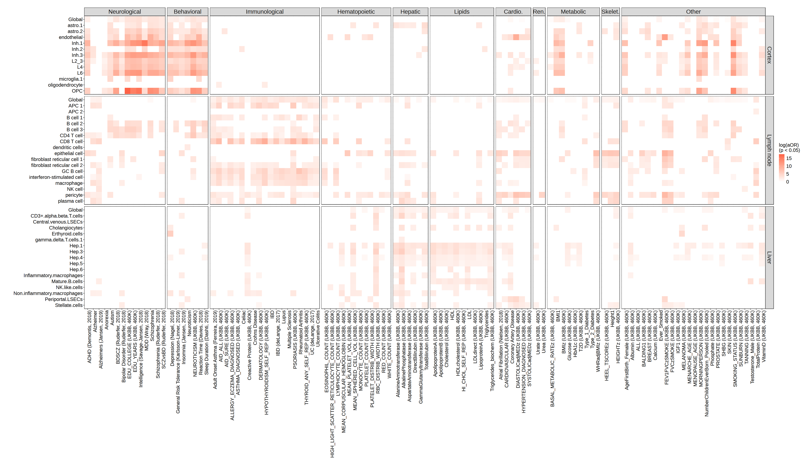

```{r, include = FALSE}
knitr::opts_chunk$set(
  collapse = TRUE,
  comment = "#>",
  fig.path = "figures/",
  out.width = "100%"
)
```

# Evaluating Disease Informativeness of Effective Spatial Variability (ESV) Values

In this vignette, we assess the **disease informativeness** of ESV and ct-ESV values obtained via Spacelink.
Disease informativeness here refers to the degree to which highly ranked ESV genes overlap 
with genes implicated in specific diseases or traits, as prioritized by PoPS (Polygenic Priority Score).

We apply this evaluation across three CosMx spatial transcriptomics datasets:

- **CosMx Human Frontal Cortex**: expected to be informative for neurological and behavioral traits
- **CosMx Human Liver**: expected to be informative for hepatic and lipid-related traits
- **CosMx Human Lymph Node**: expected to be informative for immunological and hematopoietic traits

For each dataset, ESVs are computed at two levels: 
the **global tissue level** (aggregated across all cells) and the **cell-type level** (specific to each annotated cell type). 
By comparing disease informativeness across tissues and trait categories, 
we test whether Spacelink-derived ESVs capture biologically meaningful, tissue-specific signals.

All data used in this analysis -- including Spacelink output files, PoPS scores, trait category information, and confounder tables -- are available for download at [link].

## 1. Load Packages

```{r eval=FALSE}
library(tidyverse)
library(ggplot2)
```

## 2. Load Dataset

We load four input files:

- **`spacelink_results`**: A table of ESVs computed by Spacelink for each gene across tissues and cell types. Each row corresponds to a gene–cell type pair within a given dataset, and includes the adjusted ESV score (`ESV_adj`) used downstream.
- **`pops_scores`**: A gene × trait matrix of PoPS scores, where each column represents a GWAS trait and each value reflects the posterior probability that the gene is causal for that trait. Genes are in rows and indexed by gene name.
- **`pops_trait_category`**: A lookup table mapping each PoPS trait identifier to a human-readable name (`var_clean`) and a broader biological domain (e.g., Neurological, Hepatic, Immunological). This is used to group traits in downstream visualization.
- **`confounders`**: A per-gene table of technical covariates — including mean log expression (`mean_log_expr`), proportion of non-zero counts (`non_zero_prop`), variance of log expression (`var_log_expr`), and a binary indicator for highly variable genes (`is_HVG`). These are included in the regression model to control for expression-level biases that could confound the ESV–trait association.

```{r eval=FALSE}
spacelink_results <- read.csv("data/spacelink_results.csv")
pops_scores <- read.csv("data/pops_scores.csv",row.names=1)
pops_trait_category <- read.csv("data/pops_trait_category.csv")
confounders <- read.csv("data/confounders.csv")
head(spacelink_results)
```

```{r eval=FALSE}
##   dataset cell_type  gene          pval          padj        ESV    ESV_adj
## 1  Cortex    Global  A1BG  0.000000e+00  0.000000e+00 0.99800827 0.99800827
## 2  Cortex    Global   A2M 6.187195e-268 2.259640e-267 0.08264960 0.08264960
## 3  Cortex    Global  AAAS 3.417640e-167 9.833155e-167 0.08194720 0.08194720
## 4  Cortex    Global  AAK1  0.000000e+00  0.000000e+00 0.68435610 0.68435610
## 5  Cortex    Global  AAMP  1.571541e-38  2.331317e-38 0.03354861 0.03354861
## 6  Cortex    Global AARS1  0.000000e+00  0.000000e+00 0.25700653 0.25700653
```

```{r eval=FALSE}
head(pops_scores[,1:5])
```

```{r eval=FALSE}
##         PASS_ADHD_Demontis2018 PASS_Alzheimer PASS_Alzheimers_Jansen2019 PASS_Anorexia PASS_Autism
## OR4F5                  0.00000        0.48576                    0.00000       0.80940     0.23031
## SAMD11                 0.77787        0.00000                    0.14254       0.00000     0.00000
## NOC2L                  0.36135        0.00000                    0.69540       0.00000     0.00000
## KLHL17                 0.00000        0.00000                    0.00000       0.00000     0.00000
## PLEKHN1                0.00000        0.37651                    0.24570       0.00000     0.00000
## PERM1                  0.00000        0.35478                    0.00000       0.29606     0.00000
```

```{r eval=FALSE}
head(pops_trait_category)
```

```{r eval=FALSE}
##         domain                               var                         var_clean
## 1 Neurological            PASS_ADHD_Demontis2018             ADHD (Demontis, 2018)
## 2 Neurological                    PASS_Alzheimer                         Alzheimer
## 3 Neurological        PASS_Alzheimers_Jansen2019         Alzheimers (Jansen, 2019)
## 4 Neurological                     PASS_Anorexia                          Anorexia
## 5 Neurological                       PASS_Autism                            Autism
## 6 Neurological PASS_BipolarDisorder_Ruderfer2018 Bipolar Disorder (Ruderfer, 2018)
```

```{r eval=FALSE}
head(confounders)
```

```{r eval=FALSE}
##    gene mean_log_expr non_zero_prop var_log_expr is_HVG
## 1  A1BG    2.93624386    0.98027465   0.69938240  FALSE
## 2   A2M    0.06408571    0.05133609   0.09306765  FALSE
## 3  AAAS    0.06267810    0.05912531   0.06850108  FALSE
## 4  AAK1    0.04953773    0.04759124   0.05381040  FALSE
## 5  AAMP    0.06149558    0.05870058   0.06603115  FALSE
## 6 AARS1    0.06568680    0.06295650   0.06976568  FALSE
```

## 3. Estimating Disease Informativeness via Logistic Regression

To quantify how informative each ESV is for each disease trait, 
we fit a logistic regression model for every combination of tissue, cell type, and PoPS trait. 
The outcome variable is a binary indicator of whether a gene ranks among the **top 500 PoPS genes** for that trait -- 
a threshold that captures the most strongly prioritized candidate genes from GWAS.

The key predictor is the **min-max scaled ESV** (`ESV_adj_scaled`), 
which normalizes the adjusted ESV to the [0, 1] range within each tissue–cell type combination. 
This scaling ensures comparability of coefficients across cell types. 
We additionally include four gene-level confounders -- mean log expression, proportion of non-zero counts, variance of log expression, and HVG status -- to isolate the ESV contribution from background expression patterns.

From each fitted model, we extract the **regression coefficient** for `ESV_adj_scaled`, 
which represents the log of the adjusted odds ratio (log aOR): 
the increase in log-odds of a gene being in the top 500 PoPS genes per unit increase in scaled ESV, 
after controlling for confounders. 
To focus on positive and statistically supported associations, 
coefficients with a nominal p-value ≥ 0.05 or a negative value are set to 0 in downstream analysis.

We also compute a **probabilistic recall** metric for each trait, 
defined as the sum of ESV scores over the top 500 PoPS genes divided by the total number of top 500 genes -- 
a soft measure of how well ESV ranking recovers trait-associated genes.

The outer loop iterates over tissues (`dataset`) and cell types (`cell_type`), and the inner loop iterates over all PoPS traits. 
Results are collected into a single tidy data frame `spacelink_reg_res`, 
which records the coefficient, p-value, recall, trait metadata, and tissue/cell type labels for each combination.

```{r eval=FALSE}
spacelink_reg_res <- NULL

for (tissue in unique(spacelink_results$dataset)) {
    temp_results = spacelink_results %>% filter(dataset == tissue)
    for (cell in unique(temp_results$cell_type)) {
        reg_res = vector("list", length = ncol(pops_scores))
        names(reg_res) = colnames(pops_scores)

        recall_vec = c()

        result = temp_results %>% filter(cell_type == cell)
        result$ESV_adj_scaled <- (result$ESV_adj - min(result$ESV_adj))/(max(result$ESV_adj)-min(result$ESV_adj))

        # ---- Loop over PoPS traits ----
        for (i in seq_along(colnames(pops_scores))) {

            # Prepare gene score & top 500 tag
            score = tibble(
                gene = rownames(pops_scores),
                pops_score = pops_scores[, i]
            ) %>%
            mutate(top_500_pops_gene = if_else(rank(-pops_score, ties.method = "first") <= 500, 1, 0))

            # Merge all data for modeling
            reg_tb = result %>%
                left_join(confounders, by = "gene") %>%
                left_join(score, by = "gene") %>%
                na.omit()

            reg_tb$pathway = colnames(pops_scores)[i]

            # ---- Fit logistic regression ----
            reg_res[[i]] = tryCatch(
                {
                    glm(top_500_pops_gene ~ ESV_adj_scaled + mean_log_expr + non_zero_prop + var_log_expr + is_HVG, 
                        data = reg_tb, family = "binomial") %>%
                    summary()
                },
                error = function(e) {
                    message(paste("Model fitting failed for", cell, "pathway:", colnames(pops_scores)[i]))
                }
            )

            # calculate probablistic recall
            recall <- tryCatch(sum(reg_tb$ESV_adj_scaled * reg_tb$top_500_pops_gene) / sum(reg_tb$top_500_pops_gene),
                               error = function(e) NA)

            recall_vec[i] = recall
        }

        # ---- Extract coefficient and p-value for ESV_adj ----
        get_coef = function(x) x$coefficients["ESV_adj_scaled", 1]
        get_p = function(x) x$coefficients["ESV_adj_scaled", 4]

        coef = unlist(lapply(reg_res, get_coef))
        pval = unlist(lapply(reg_res, get_p))
        var  = names(reg_res)

        # ---- Save results as tidy tibble ----
        reg_res = tibble(var, coef, pval, recall = recall_vec) %>%
            left_join(pops_trait_category, by = "var") %>%
            mutate(dataset = tissue, cell_type = cell)
        spacelink_reg_res <- rbind(spacelink_reg_res, reg_res)
    }
}
```

```{r eval=FALSE}
head(spacelink_reg_res)
```

```{r eval=FALSE}
## # A tibble: 6 × 8
##   var                                  coef     pval recall domain       var_clean                         dataset cell_type
##   <chr>                               <dbl>    <dbl>  <dbl> <chr>        <chr>                             <chr>   <chr>    
## 1 PASS_ADHD_Demontis2018             1.85   1.02e-22  0.269 Neurological ADHD (Demontis, 2018)             Cortex  Global   
## 2 PASS_Alzheimer                    -0.0174 9.50e- 1  0.144 Neurological Alzheimer                         Cortex  Global   
## 3 PASS_Alzheimers_Jansen2019        -0.310  2.48e- 1  0.138 Neurological Alzheimers (Jansen, 2019)         Cortex  Global   
## 4 PASS_Anorexia                      0.391  1.04e- 1  0.163 Neurological Anorexia                          Cortex  Global   
## 5 PASS_Autism                        1.23   8.83e- 9  0.215 Neurological Autism                            Cortex  Global   
## 6 PASS_BipolarDisorder_Ruderfer2018  1.55   5.49e-14  0.241 Neurological Bipolar Disorder (Ruderfer, 2018) Cortex  Global
```

## 4. Visualization: Tissue-Specific Disease Informativeness Heatmap

To evaluate whether ESVs from each tissue are preferentially informative for biologically relevant disease traits, 
we visualize the log aOR values as a **faceted heatmap**, 
with cell types on the y-axis, individual traits on the x-axis, 
and tiles colored by the magnitude of the log aOR.

Traits are grouped into 11 biological domains -- Neurological, Behavioral, Immunological, Hematopoietic, Hepatic, Lipids, Cardiovascular, Renal, Metabolic, Skeletal, and Other -- and the heatmap is faceted by both tissue (rows) and domain (columns), 
allowing direct visual comparison of tissue–trait specificity.

Before plotting, we apply the significance filter: any coefficient with p ≥ 0.05 or a negative value is set to 0 (`adj_log_aOR`). 
Domain labels are abbreviated for display clarity (e.g., Cardiovascular → Cardio.), 
and factor levels are set to enforce a consistent ordering of tissues and domains across panels.

A strong result would show that ESVs from a given tissue yield high log aOR values specifically within that tissue's expected trait domain -- for example, cortex ESVs scoring highly for Neurological/Behavioral traits, but not for Hepatic or Immunological ones.


```{r eval=FALSE}
plot_df = spacelink_reg_res %>% mutate(adj_log_aOR = ifelse(pval < 0.05 & coef > 0, coef, 0))
plot_df$dataset = factor(plot_df$dataset, levels=c("Cortex","Lymph node","Liver"))
plot_df$cell_type = factor(plot_df$cell_type, levels=rev(unique(plot_df$cell_type)))
plot_df$domain = recode_factor(plot_df$domain,
                               "Cardiovascular"="Cardio.", "Renal"="Ren.", "Skeletal"="Skelet.")
plot_df$domain = factor(plot_df$domain, levels=c("Neurological","Behavioral","Immunological","Hematopoietic","Hepatic","Lipids","Cardio.","Ren.","Metabolic","Skelet.","Other"))


options(repr.plot.width=35, repr.plot.height=20)
ggplot(plot_df, aes(x = var_clean, y = cell_type, fill = adj_log_aOR)) +
    geom_tile() + 
    scale_fill_gradient(low="white",high="tomato",name="log(aOR)\n(p < 0.05)") +
    facet_grid(rows=vars(dataset),cols=vars(domain), scales = "free", space = "free") +
    theme_bw() + labs(title="",x="",y="") + 
    theme(strip.text = element_text(size=18),
          axis.text.x = element_text(angle=90, hjust=1, vjust=1, size=15, color = "black"), 
          axis.text.y = element_text(size=15, color = "black"),
          legend.title = element_text(size=15), legend.text = element_text(size=15))
```

{#id .class width=100% height=100%}

The heatmap confirms the expected tissue-specificity of disease informativeness of ESVs. 
Cortex ESVs show elevated log aOR values concentrated in the Neurological and Behavioral domains, 
consistent with the brain's role in psychiatric and cognitive disorders. 
Lymph node ESVs are enriched for Immunological traits, reflecting the lymph node's central function in adaptive immunity. 
Liver ESVs are most informative for Hepatic and Lipids traits, in line with the liver's dominant role in lipid metabolism and hepatic disease. 
Across all three tissues, ESVs from non-relevant trait domains mostly remain close to zero, 
demonstrating that Spacelink captures tissue-specific disease signals rather than generic expression patterns.
