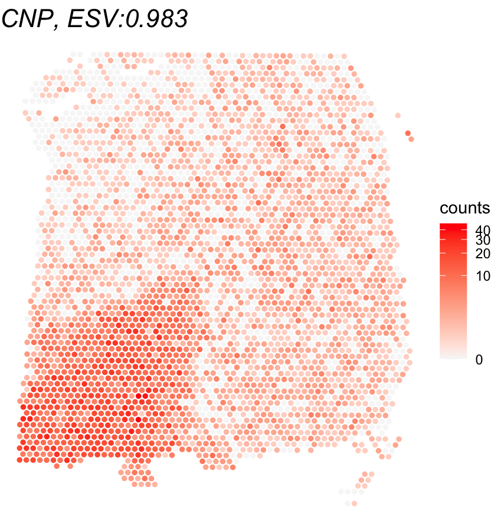
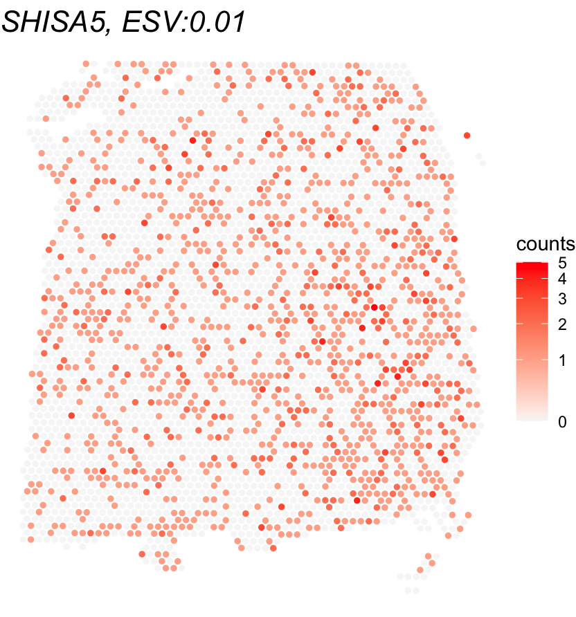
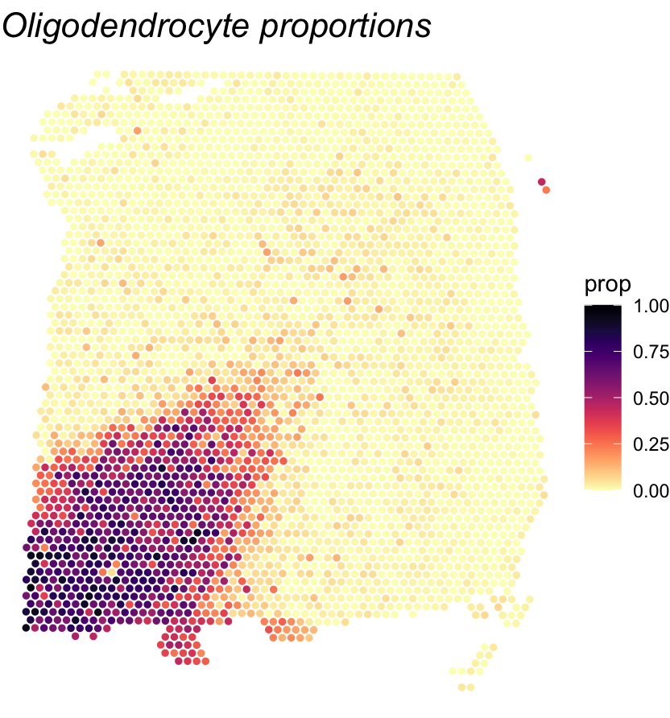
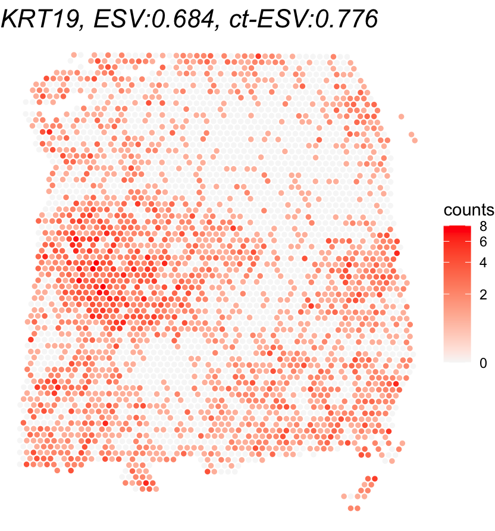
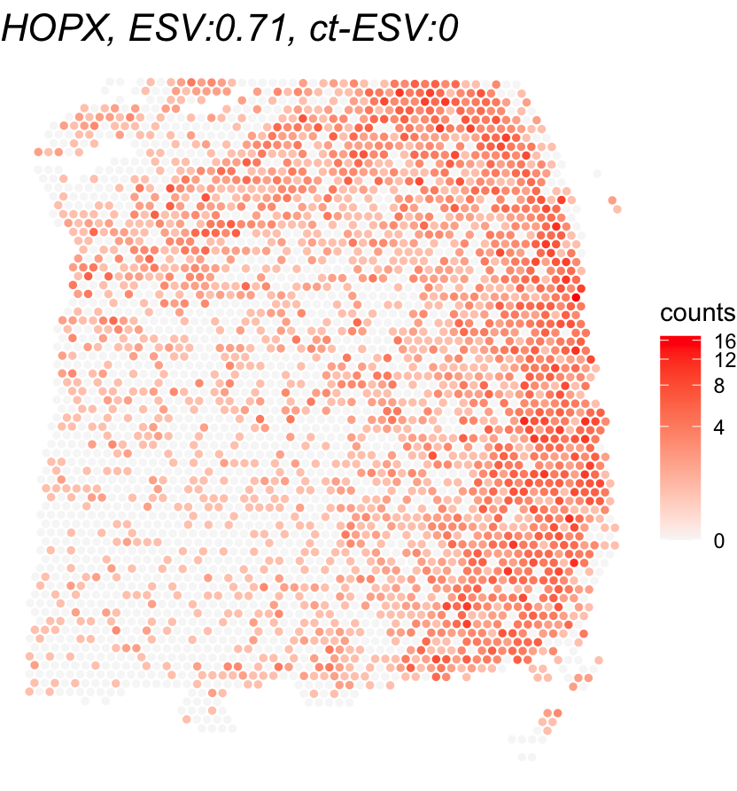

```{r, include = FALSE}
knitr::opts_chunk$set(
  collapse = TRUE,
  comment = "#>",
  fig.path = "figures/",
  out.width = "100%"
)
```

# Application of Spacelink to Visium Human DLPFC Dataset

Here, we demonstrate how to perform SVG analysis using the **spacelink** package with a Visium human dorsolateral prefrontal cortex (DLPFC) dataset.
The dataset is available [here](https://research.libd.org/spatialLIBD/), and we use sample 151673. 
Cell-type proportions were estimated using [RCTD](https://github.com/dmcable/spacexr) with the [CosMx Human Frontal Cortex dataset](https://nanostring.com/products/cosmx-spatial-molecular-imager/ffpe-dataset/human-frontal-cortex-ffpe-dataset/) as a reference. 
The processed example data, provided as [`Visium_human_DLPFC`](https://hanbyul-lee.github.io/spacelink/reference/Visium_human_DLPFC.html), includes gene expression, spot coordinates, and the estimated cell type proportions.

## 1. Load Packages

```{r eval=FALSE}
library(spacelink)
library(Seurat)
library(sctransform)
library(ggplot2)
library(viridis)
```

## 2. Load Example Dataset

Here we load the built-in example dataset for Visium Human DLPFC (sample 151673).
It comes with three pieces of information we'll use throughout the analysis:

- `counts`: gene expression matrix (33,538 genes × 3,639 spots)
- `spatial_coords`: spatial coordinates for each spot
- `cell_type_proportions`: estimated cell type compositions via RCTD (9 cell types)

```{r eval=FALSE}
data(Visium_human_DLPFC)
counts <- Visium_human_DLPFC$counts
spatial_coords <- Visium_human_DLPFC$spatial_coords
cell_type_proportions <- Visium_human_DLPFC$cell_type_proportions
head(counts[,1:10])
```

```{r eval=FALSE}
## 6 x 10 sparse Matrix of class "dgTMatrix"
##   [[ suppressing 10 column names ‘AAACAAGTATCTCCCA-1’, ‘AAACAATCTACTAGCA-1’, ‘AAACACCAATAACTGC-1’ ... ]]                               
## MIR1302-2HG . . . . . . . . . .
## FAM138A     . . . . . . . . . .
## OR4F5       . . . . . . . . . .
## AL627309.1  . . . . . . . . . .
## AL627309.3  . . . . . . . . . .
## AL627309.2  . . . . . . . . . .
```

```{r eval=FALSE}
dim(counts)
```

```{r eval=FALSE}
## [1] 33538  3639
```

```{r eval=FALSE}
head(spatial_coords)
```

```{r eval=FALSE}
##                    pxl_col_in_fullres pxl_row_in_fullres
## AAACAAGTATCTCCCA-1               9791               8468
## AAACAATCTACTAGCA-1               5769               2807
## AAACACCAATAACTGC-1               4068               9505
## AAACAGAGCGACTCCT-1               9271               4151
## AAACAGCTTTCAGAAG-1               3393               7583
## AAACAGGGTCTATATT-1               3665               8064
```

```{r eval=FALSE}
dim(spatial_coords)
```

```{r eval=FALSE}
## [1] 3639  2
```

```{r eval=FALSE}
head(cell_type_proportions)
```

```{r eval=FALSE}
##                     endothelial       L2_3           L4           L6 oligodendrocyte          OPC       astro         Inh    microglia
## AAACAAGTATCTCCCA-1 2.331552e-02 0.86383709 9.941496e-05 8.994572e-05     0.008841064 8.994572e-05 0.037094727 0.060440671 0.0061916188
## AAACAATCTACTAGCA-1 7.952809e-02 0.55623941 1.284478e-04 1.413909e-02     0.001048564 1.284478e-04 0.083634323 0.264896732 0.0002568957
## AAACACCAATAACTGC-1 4.144100e-05 0.07909515 4.144100e-05 8.593492e-02     0.826629114 7.799136e-05 0.006276291 0.000124323 0.0017793364
## AAACAGAGCGACTCCT-1 4.419690e-04 0.70660998 1.437067e-04 1.437067e-04     0.012711896 1.437067e-04 0.119882025 0.133047245 0.0268757663
## AAACAGCTTTCAGAAG-1 1.398113e-02 0.52170271 8.882893e-05 2.874930e-01     0.050319200 8.882893e-05 0.026019353 0.096453571 0.0038533732
## AAACAGGGTCTATATT-1 8.872097e-05 0.37248441 8.872097e-05 3.500929e-01     0.206785555 8.872097e-05 0.029330741 0.040862758 0.0001774419
```

```{r eval=FALSE}
dim(cell_type_proportions)
```

```{r eval=FALSE}
## [1] 3639    9
```

## 3. Preprocessing

Before running the analysis, we do a bit of cleaning.
First, we remove mitochondrial genes since high mitochondrial expression usually signals low-quality or damaged cells rather than real biology.
We also drop genes that are expressed in very few spots (less than 0.5%), as they don't carry enough information to be useful.
Finally, we normalize the counts using [SCTransform](https://satijalab.org/seurat/reference/sctransform), which corrects for differences in sequencing depth across spots.

```{r eval=FALSE}
counts <- counts[!grepl("(^MT-)|(^mt-)", rownames(counts)),]
counts <- counts[apply(counts >= 3, 1, sum) >= ncol(counts)*0.005,]
dim(counts)
```

```{r eval=FALSE}
## [1] 3309  3639
```

```{r eval=FALSE}
seurat_obj <- CreateSeuratObject(counts = counts)
seurat_norm = SCTransform(seurat_obj, vst.flavor = "v2", verbose = FALSE)
normalized_counts <- seurat_norm@assays$SCT$data
head(normalized_counts[,1:10])
```

```{r eval=FALSE}
## 6 x 10 sparse Matrix of class "dgCMatrix"
##   [[ suppressing 10 column names ‘AAACAAGTATCTCCCA-1’, ‘AAACAATCTACTAGCA-1’, ‘AAACACCAATAACTGC-1’ ... ]]                                                    ##                             
## HES4  0.6931472 .        . .         .         .         . .         .         .
## ISG15 .         .        . .         0.6931472 .         . 0.6931472 .         .
## AGRN  0.6931472 1.386294 . .         0.6931472 .         . 0.6931472 .         .
## SDF4  0.6931472 .        . 0.6931472 .         .         . .         0.6931472 .
## ACAP3 0.6931472 .        . .         .         .         . .         0.6931472 .
## DVL1  .         .        . .         .         0.6931472 . .         .         .
```


## 4. Run Global Spacelink

Now we're ready to run the main analysis. 
Here we use [`spacelink`](https://hanbyul-lee.github.io/spacelink/reference/spacelink.html) to identify spatially variable genes (SVGs) across the tissue.
We'll test this on 6 example genes to keep things simple.
The two numbers to pay attention to in the results are `padj` (whether the spatial autocorrelation is statistically significant) and `ESV_adj` (how strong that spatial autocorrelation is, on a scale from 0 to 1).
Note that the `padj` and `ESV_adj` values will differ when running the analysis on the full gene set, because the Benjamini–Hochberg adjustment is applied across all genes. In this example, the adjustment is performed using only the six selected genes.

```{r eval=FALSE}
gene_list <- c("CNP","EIF5B","HOPX","KRT19","PHB","SHISA5")
global_results <- spacelink(
  normalized_counts = normalized_counts[gene_list,],
  spatial_coords = spatial_coords
)
print(global_results[order(global_results$ESV_adj, decreasing=T),c("time","pval","padj","ESV","ESV_adj")])
```

```{r eval=FALSE}
##         time       pval        padj         ESV     ESV_adj
## CNP    4.082 0.00000000 0.000000000 0.982947579 0.982947579
## HOPX   3.904 0.00000000 0.000000000 0.709631417 0.709631417
## KRT19  3.792 0.00000000 0.000000000 0.684495108 0.684495108
## EIF5B  3.736 0.00373013 0.005595195 0.025783391 0.025783391
## SHISA5 3.736 0.02000210 0.024002518 0.009663969 0.009663969
## PHB    3.734 0.10824339 0.108243395 0.026795125 0.000000000
```

## 5. Visualize Global Spacelink Results

To get an intuitive sense of what the ESV score means, let's plot the gene with the highest ESV alongside the one with the lowest.
This gives us a side-by-side comparison of a strong SVG vs. a non-SVG, showing how differently their expression is distributed across the tissue.

```{r eval=FALSE}
gene_names <- rownames(global_results)[c(which.max(global_results$ESV_adj),
                                         which.min(global_results$ESV))]

for(gene_name in gene_names){
  df <- as.data.frame(cbind(spatial_coords, expr = counts[gene_name,]))
  colnames(df) <- c('X0', 'X1', 'expr')
  title <- paste0(gene_name, ", ESV:", round(global_results[gene_name,'ESV'],3))
  print(ggplot(df, aes(x = X0, y = X1, color = expr)) +
    geom_point(size = 1) +
    ggtitle(title) + theme_void() + scale_y_reverse() +
    scale_color_gradient(low = "grey97", high = "red", trans = "log1p", name = "counts") +
    theme(plot.title = element_text(face = "italic", size = 16)))
}
```

{#id .class width=50% height=50%}

{#id .class width=50% height=50%}

## 6. Run Cell-type-specific Spacelink

Here, we dig a little deeper by asking whether a gene's spatial pattern emerges within a particular cell type.
We use [`spacelink_ctSVG`](https://hanbyul-lee.github.io/spacelink/reference/spacelink_ctSVG.html) with *oligodendrocyte* as our focal cell type.
The ct-ESV score in the output works the same way as ESV, but specifically reflects variability tied to that cell type.
Again, note that the `padj` and `ESV_adj` values will differ when running the analysis on the full gene set, because the Benjamini–Hochberg adjustment is applied across all genes. In this example, the adjustment is performed using only the six selected genes.

```{r eval=FALSE}
cell_type_results <- spacelink_ctSVG(
  normalized_counts = normalized_counts[gene_list,],
  spatial_coords = spatial_coords,
  cell_type_proportions = cell_type_proportions,
  focal_cell_type = "oligodendrocyte"
)

print(cell_type_results[order(cell_type_results$ESV_adj, decreasing=T),])
```

```{r eval=FALSE}
##           time         pval         padj          ESV   ESV_adj
## KRT19  112.470 2.295822e-06 6.887466e-06 7.762241e-01 0.7762241
## CNP    130.494 7.442970e-07 4.465782e-06 6.518893e-01 0.6518893
## EIF5B  148.584 2.066347e-01 4.132695e-01 2.195354e-01 0.0000000
## HOPX   121.434 9.434479e-01 9.434479e-01 2.236363e-05 0.0000000
## PHB    144.309 3.258193e-01 4.887289e-01 4.234864e-02 0.0000000
## SHISA5 149.888 6.209340e-01 7.451208e-01 1.455330e-02 0.0000000
```

## 7. Visualize Cell-type-specific Spacelink Results

To wrap up, we visualize the results of the cell-type-specific analysis.
We first plot the oligodendrocyte proportions across the tissue to see where this cell type is concentrated. 
Then, we compare the gene with the highest ct-ESV to the one with the lowest.
Looking at both ESV and ct-ESV together helps us understand whether a gene's spatial pattern is really being driven by oligodendrocytes or by something else entirely.

```{r eval=FALSE}
gene_names <- rownames(cell_type_results)[c(which.max(cell_type_results$ESV_adj),
                                            which.min(cell_type_results$ESV))]

# Visualize oligodendrocyte proportions
df <- as.data.frame(cbind(spatial_coords, expr = cell_type_proportions[,'oligodendrocyte']))
colnames(df) <- c('X0', 'X1', 'prop')
print(ggplot(df, aes(x = X0, y = X1, color = prop)) +
        geom_point(size = 1) +
        ggtitle("Oligodendrocyte proportions") + theme_void() + scale_y_reverse() +
        scale_color_viridis(option="magma", direction=-1, limits=c(0,1)) +
        theme(plot.title = element_text(face = "italic", size = 16)))

# Visualize gene expression (compare ESV vs ct-ESV)
for(gene_name in gene_names){
  df <- as.data.frame(cbind(spatial_coords, expr = counts[gene_name,]))
  colnames(df) <- c('X0', 'X1', 'expr')
  title <- paste0(gene_name,
                  ", ESV:", round(global_results[gene_name,'ESV'],3),
                  ", ct-ESV:", round(cell_type_results[gene_name,'ESV'],3))
  print(ggplot(df, aes(x = X0, y = X1, color = expr)) +
          geom_point(size = 1) +
          ggtitle(title) + theme_void() + scale_y_reverse() +
          scale_color_gradient(low = "grey97", high = "red", trans = "log1p", name = "counts") +
          theme(plot.title = element_text(face = "italic", size = 16)))
}
```

{#id .class width=50% height=50%}

{#id .class width=50% height=50%}

{#id .class width=50% height=50%}