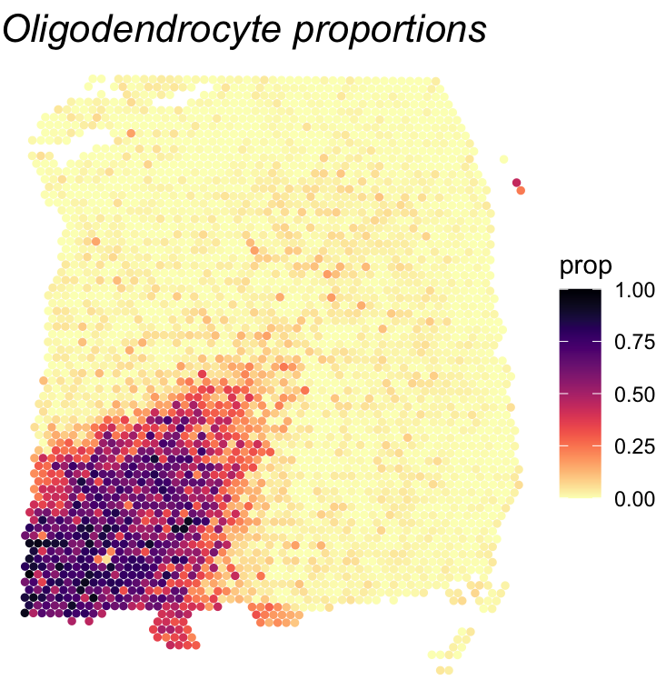
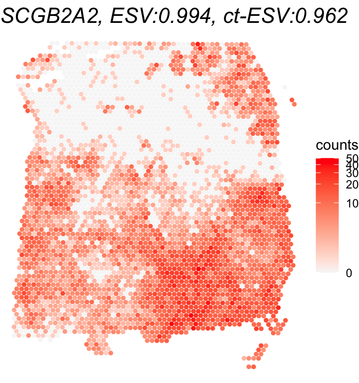
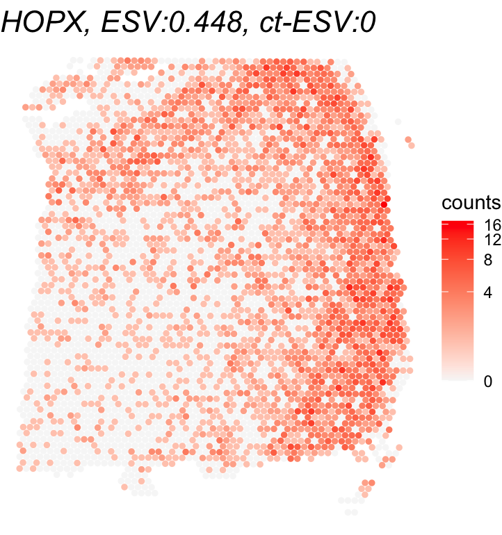

```{r, include = FALSE}
knitr::opts_chunk$set(
  collapse = TRUE,
  comment = "#>",
  fig.path = "figures/",
  out.width = "100%"
)
```

# Application of Spacelink to Visium Human DLPFC Dataset

This vignette demonstrates how to perform spatial gene expression analysis using the `spacelink` package with Visium human dorsolateral prefrontal cortex (DLPFC) dataset.
The dataset is available [here](https://research.libd.org/spatialLIBD/), where we used sample 151673. 
Cell-type proportions were estimated using [RCTD](https://github.com/dmcable/spacexr) with the [CosMx Human Frontal Cortex dataset](https://nanostring.com/products/cosmx-spatial-molecular-imager/ffpe-dataset/human-frontal-cortex-ffpe-dataset/) as the reference. 
The processed example data, saved as `Visium_human_DLPFC`, includes gene expression, spot coordinates, and the estimated cell type proportions.

## Load packages

```{r eval=FALSE}
library(spacelink)
library(Seurat)
library(sctransform)
library(ggplot2)
library(viridis)
```

## Load example dataset

```{r eval=FALSE}
data(Visium_human_DLPFC)
counts <- Visium_human_DLPFC$counts
spatial_coords <- Visium_human_DLPFC$spatial_coords
dim(counts)
```

```{r eval=FALSE}
## [1] 33538  3639
```

```{r eval=FALSE}
dim(spatial_coords)
```

```{r eval=FALSE}
## [1] 3639  2
```

## Preprocessing

```{r eval=FALSE}
# Filter mitochondrial and low-expressed genes
counts <- counts[!grepl("(^MT-)|(^mt-)", rownames(counts)),]
counts <- counts[rowSums(counts >= 3) >= ncol(counts)*0.005,]
dim(counts)
```

```{r eval=FALSE}
## [1] 3309  3639
```

```{r eval=FALSE}
# Normalize expression counts using sctransform package
seurat_obj <- CreateSeuratObject(counts = counts)
seurat_norm = SCTransform(seurat_obj, vst.flavor = "v2", verbose = FALSE)
normalized_counts <- seurat_norm@assays$SCT$data
```

## Run global Spacelink

```{r eval=FALSE}
# Here, we investigate eight example genes.
gene_list = c("CNP","SHISA5","PHB","HOPX","MOBP","EIF5B","SCGB2A2","YWHAE")
global_results <- spacelink_global(normalized_counts = normalized_counts[gene_list,],
                                   spatial_coords = spatial_coords)
print(global_results)
```

```{r eval=FALSE}
##            tau.sq  sigma.sq1    sigma.sq2    sigma.sq3    sigma.sq4 sigma.sq5        phi1         phi2         phi3         phi4         phi5     raw_ESV  time       pval1       pval2         pval3         pval4         pval5        pval        padj         ESV
## CNP     0.0000000 0.00000000 0.7015934749 0.2179618252 0.000000e+00         0 0.001048406 0.0009286621 0.0008225946 0.0007286417 0.0006454196 0.994768081 4.999 0.000000000 0.000000000  0.000000e+00  0.000000e+00  0.000000e+00 0.000000000 0.000000000 0.994768081
## SHISA5  0.1500294 0.00000000 0.0004149912 0.0006837337 0.000000e+00         0 0.001703009 0.0013362057 0.0010484062 0.0008225946 0.0006454196 0.007209596 4.631 0.018972197 0.014445518  1.518510e-02  2.165076e-02  3.749959e-02 0.019186192 0.025581589 0.007209596
## PHB     0.1369763 0.00508862 0.0000000000 0.0000000000 0.000000e+00         0 0.007299270 0.0064655812 0.0057271124 0.0050729880 0.0044935748 0.026105641 4.189 0.118799139 0.110644681  1.091531e-01  1.136193e-01  1.235950e-01 0.114928890 0.131347303 0.000000000
## HOPX    0.1844922 0.00000000 0.0720213108 0.0766421489 2.561652e-03         0 0.001048406 0.0009286621 0.0008225946 0.0007286417 0.0006454196 0.448242916 4.147 0.000000000 0.000000000 2.611455e-312 5.377138e-281 2.750916e-250 0.000000000 0.000000000 0.448242916
## MOBP    0.0000000 0.00000000 0.4831314048 0.1345105327 0.000000e+00         0 0.001048406 0.0009286621 0.0008225946 0.0007286417 0.0006454196 0.994747311 4.422 0.000000000 0.000000000  0.000000e+00  0.000000e+00  0.000000e+00 0.000000000 0.000000000 0.994747311
## EIF5B   0.1113762 0.00000000 0.0000000000 0.0016466986 0.000000e+00         0 0.002766333 0.0021705050 0.0017030094 0.0013362057 0.0010484062 0.014321150 4.074 0.003477314 0.001992989  1.645165e-03  2.147440e-03  4.220251e-03 0.002381182 0.003809891 0.014321150
## SCGB2A2 0.0000000 0.13916786 0.7402986887 0.1394122051 0.000000e+00         0 0.001048406 0.0009286621 0.0008225946 0.0007286417 0.0006454196 0.994473609 4.939 0.000000000 0.000000000  0.000000e+00  0.000000e+00  0.000000e+00 0.000000000 0.000000000 0.994473609
## YWHAE   0.2485001 0.00000000 0.0011635764 0.0012691117 9.102338e-05         0 0.004493575 0.0039803394 0.0035257234 0.0031230316 0.0027663334 0.009273184 4.009 0.183838106 0.173973851  1.681146e-01  1.660988e-01  1.675962e-01 0.171708675 0.171708675 0.000000000
```

## Investigate global Spacelink result

The primary results are as follows:

- `pval` : Combined p-value for spatial significance
- `padj` : Benjamini-Hochberg adjusted p-values
- `ESV` : Effective Spatial Variability score (0-1)

```{r eval=FALSE}
# Number of significant SVGs
table(global_results$padj <= 0.05)
```

```{r eval=FALSE}
## FALSE  TRUE 
##     2     6
```

Top-ranked SVGs can be identified using the ESV score. 
Shown here is an example plotting the SVG with the highest ESV and a non-SVG with the lowest ESV score.

```{r eval=FALSE}
# Plot of the top SVG (highest ESV) and a non-SVG (lowest ESV)
gene_names = rownames(global_results)[c(which.max(global_results$ESV),
                                        which.min(global_results$ESV))]
print(gene_names)
```

```{r eval=FALSE}
## [1] "CNP"    "PHB"
```

```{r eval=FALSE}
for(gene_name in gene_names){
  df <- as.data.frame(cbind(spatial_coords, expr = counts[gene_name,]))
  colnames(df) <- c('X0', 'X1', 'expr')
  title <- paste0(gene_name, ", ESV:", round(global_results[gene_name,'ESV'],3))
  print(ggplot(df, aes(x = X0, y = X1, color = expr)) + 
    geom_point(size = 1) + 
    ggtitle(title) + theme_void() + scale_y_reverse() + 
    scale_color_gradient(low = "grey97", high = "red", trans = "log1p", name = "counts") + 
    theme(plot.title = element_text(face = "italic", size = 16)))
}
```

{#id .class width=50% height=50%}

{#id .class width=50% height=50%}

## Run cell-type-specific Spacelink

```{r eval=FALSE}
# Load cell type proportions
cell_type_proportions <- Visium_human_DLPFC$cell_type_proportions
dim(cell_type_proportions)
```

```{r eval=FALSE}
## [1] 3639  9
```

```{r eval=FALSE}
colnames(cell_type_proportions)
```

```{r eval=FALSE}
## [1] "endothelial"  "L2_3"  "L4"  "L6"  "oligodendrocyte"  
## [6] "OPC"  "astro"  "Inh"  "microglia"
```

```{r eval=FALSE}
# In this example, we examine the oligodendrocyte-specific spatial variability.
cell_type_results <- 
  spacelink_cell_type(normalized_counts = normalized_counts[gene_list,], 
                      spatial_coords = spatial_coords, 
                      cell_type_proportions = cell_type_proportions, 
                      focal_cell_type = "oligodendrocyte",
                      global_spacelink_results = global_results, 
                      # The above is not required, though providing global results can improve efficiency.
                      calculate_ESV = TRUE)
print(cell_type_results)
```

```{r eval=FALSE}
##            time         pval          ESV
## CNP      89.171 2.198766e-11 6.739803e-01
## SHISA5   98.919 6.202876e-01 1.447781e-02
## PHB     119.905 3.490079e-01 3.660781e-02
## HOPX     83.524 7.563056e-01 1.991051e-05
## MOBP    135.633 4.283413e-02 6.835911e-01
## EIF5B   104.500 4.050604e-01 1.065050e-01
## SCGB2A2  86.259 1.338166e-08 9.615069e-01
## YWHAE    84.141 8.624388e-01 1.844341e-05
```

## Investigate cell-type-specific Spacelink result

The key results are as follows:

- `pval` : Combined p-value for spatial significance
- `ESV` : Cell-type-specific Effective Spatial Variability (ct-ESV) score (0-1)

```{r eval=FALSE}
# Number of significant ct-SVGs within oligodendrocyte
table(cell_type_results$pval <= 0.05)
```

```{r eval=FALSE}
## FALSE  TRUE 
##     5     3 
```

The following illustrates the ct-SVG with the highest ct-ESV and a non-ct-SVG with the lowest ct-ESV among significant global SVGs identified by the global Spacelink analysis.

```{r eval=FALSE}
# Plot of the top ct-SVG (highest ct-ESV) and a non-ct-SVG (lowest ct-ESV) among significant global SVGs
global_svg_names = rownames(global_results)[global_results$padj <= 0.05]
gene_names = global_svg_names[c(which.max(cell_type_results[global_svg_names,'ESV']),
                                which.min(cell_type_results[global_svg_names,'ESV']))]
print(gene_names)
```

```{r eval=FALSE}
## [1] "SCGB2A2" "HOPX" 
```

```{r eval=FALSE}
# Plot oligodendrocyte cell type proportions
df <- as.data.frame(cbind(spatial_coords, expr = cell_type_proportions[,'oligodendrocyte']))
colnames(df) <- c('X0', 'X1', 'prop')
print(ggplot(df, aes(x = X0, y = X1, color = prop)) + 
        geom_point(size = 1) + 
        ggtitle("Oligodendrocyte proportions") + theme_void() + scale_y_reverse() + 
        scale_color_viridis(option="magma",direction=-1,limits=c(0,1)) + 
        theme(plot.title = element_text(face = "italic", size = 16)))

# Plot gene expressions
for(gene_name in gene_names){
  df <- as.data.frame(cbind(spatial_coords, expr = counts[gene_name,]))
  colnames(df) <- c('X0', 'X1', 'expr')
  title <- paste0(gene_name, ", ESV:", round(global_results[gene_name,'ESV'],3), 
                  ", ct-ESV:", round(cell_type_results[gene_name,'ESV'],3))
  print(ggplot(df, aes(x = X0, y = X1, color = expr)) + 
          geom_point(size = 1) + 
          ggtitle(title) + theme_void() + scale_y_reverse() + 
          scale_color_gradient(low = "grey97", high = "red", trans = "log1p", name = "counts") + 
          theme(plot.title = element_text(face = "italic", size = 16)))
}
```

{#id .class width=50% height=50%}

{#id .class width=50% height=50%}

{#id .class width=50% height=50%}