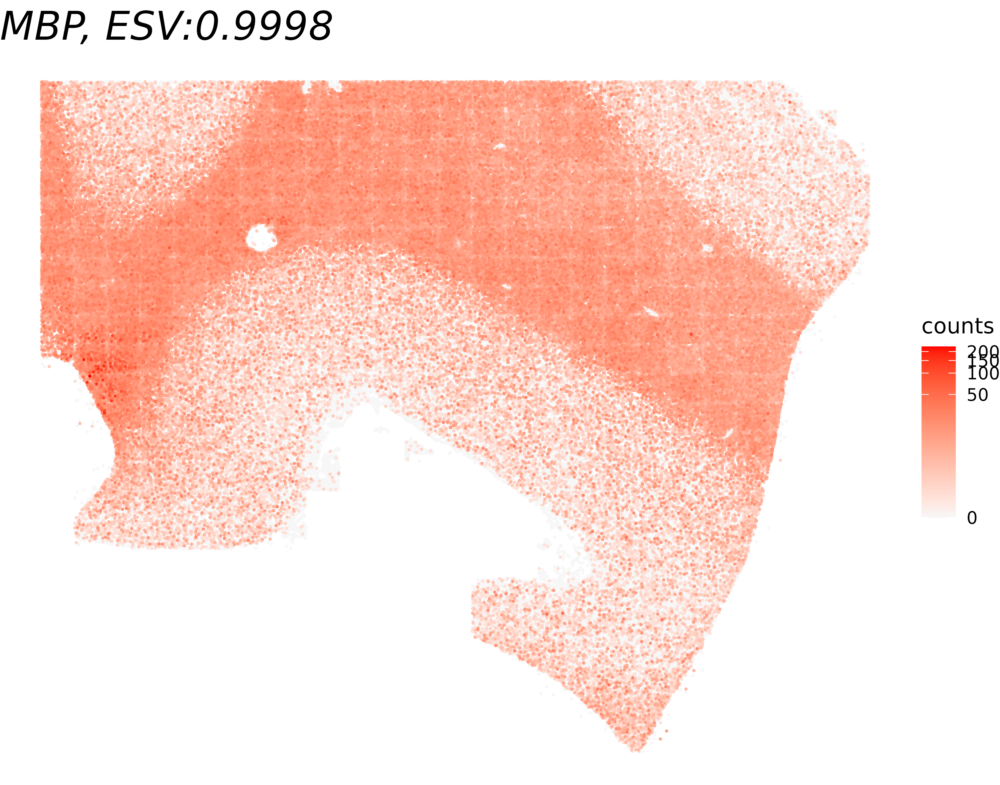
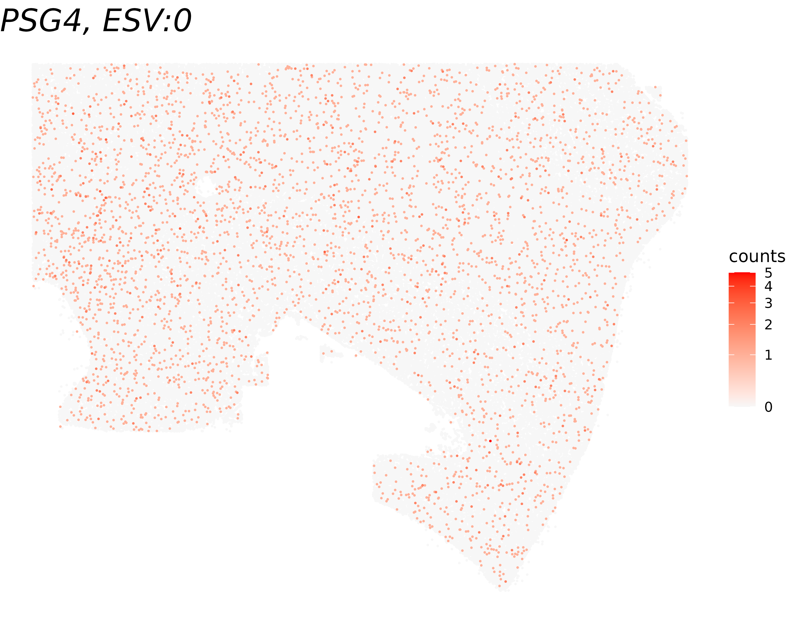
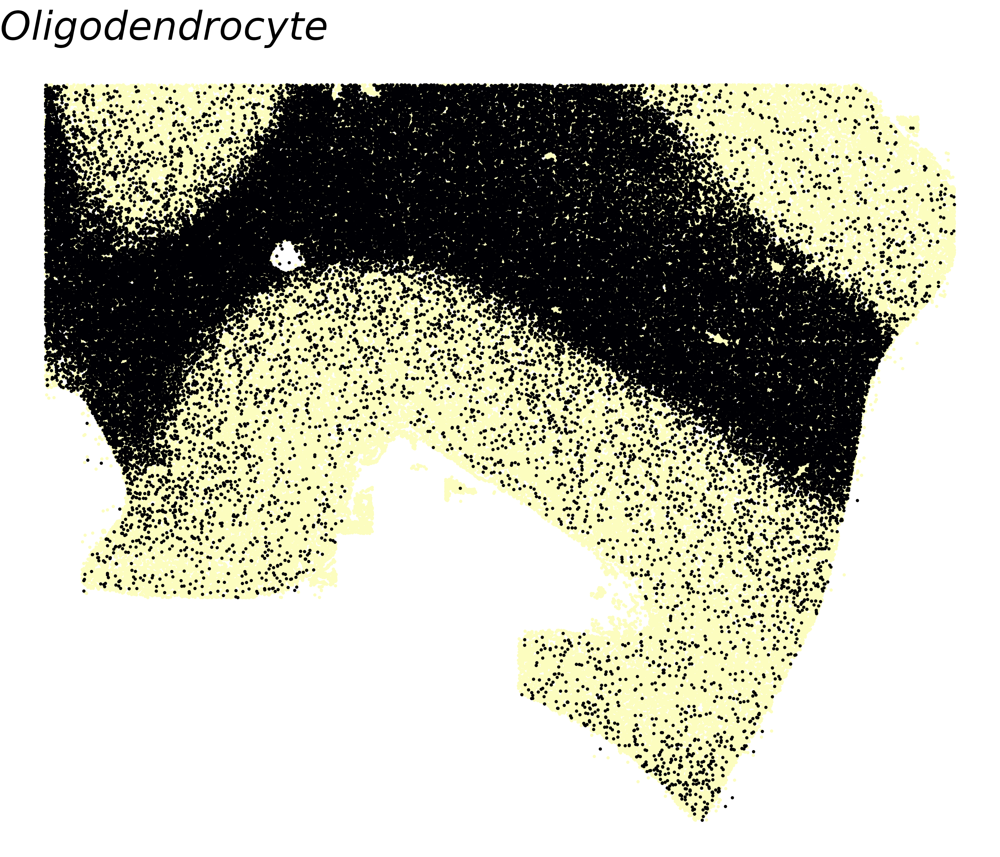
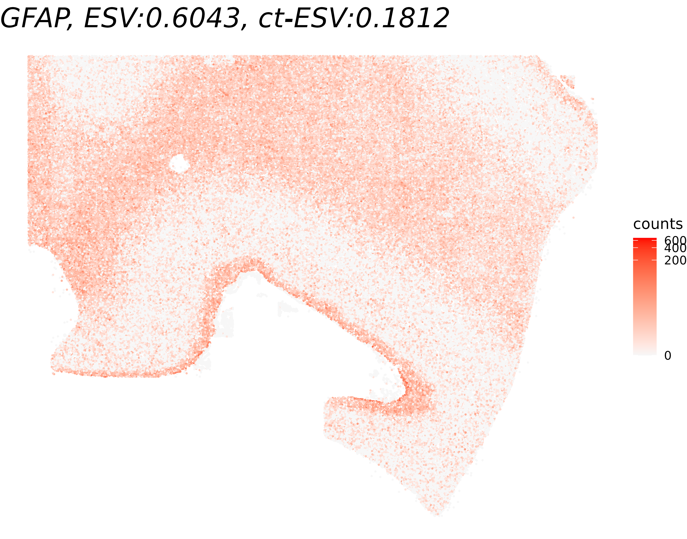
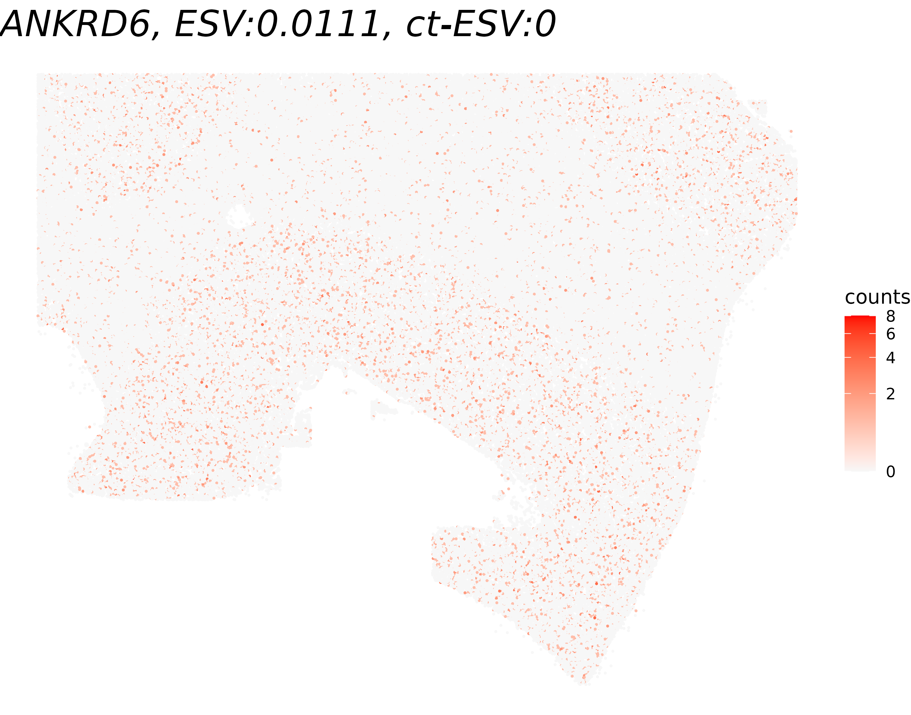

```{r, include = FALSE}
knitr::opts_chunk$set(
  collapse = TRUE,
  comment = "#>",
  fig.path = "figures/",
  out.width = "100%"
)
```


Here, we demonstrate how to perform SVG analysis using the `spacelink` package with a large-scale, single-cell resolution spatial transcriptomics dataset.
We use the CosMx Human Frontal Cortex dataset (number of spots = 188,686) as an example.
The dataset is publicly available [here](https://brukerspatialbiology.com/products/cosmx-spatial-molecular-imager/ffpe-dataset/human-frontal-cortex-ffpe-dataset/).

We walk through the full Spacelink workflow in two stages: (1) **global tissue-level** SVG detection, 
which tests for spatial variability across all cells regardless of cell type, 
and (2) **cell-type-specific** SVG detection, 
which restricts the analysis to a specific cell-type to identify spatially variability within that cell population.


## 1. Load Dataset

We load the CosMx cortex dataset stored as a `Seurat` object. 
We extract three components needed for the analysis:

- **`counts`**: Gene expression matrix (6,278 genes × 188,686 cells)
- **`spatial_coords`**: Spatial coordinates for each cell
- **`cell_type_info`**: One-hot encoded matrix of cell type assignments (14 cell types)


```{r eval=FALSE}
library(Seurat)
library(stringr)

seurat_obj <- readRDS("SeuratObj_withTranscripts.RDS")
counts <- GetAssayData(seurat_obj, assay = "RNA", layer = "counts")
spatial_coords <- seurat_obj@meta.data[,c('x_slide_mm','y_slide_mm')]
cell_type_info <- model.matrix(~ RNA_nbclust_clusters_refined - 1, data = seurat_obj@meta.data)
colnames(cell_type_info) <- str_remove(colnames(cell_type_info), "RNA_nbclust_clusters_refined")
head(counts[,1:10])
```

```{r eval=FALSE}
## 6 x 10 sparse Matrix of class "dgCMatrix"
##   [[ suppressing 10 column names ‘c_1_100_131’, ‘c_1_100_156’, ‘c_1_100_240’ ... ]]                         
## A1BG  3 1 1 . . . . 1 2 3
## A2M   . . 2 . . . 1 . 1 .
## AAAS  . . . . 1 . 1 . . .
## AAK1  6 . . 3 1 1 . . 1 .
## AAMP  4 . 1 3 . 1 . 1 2 .
## AARS1 6 . . 1 . 2 1 1 . .
```

```{r eval=FALSE}
head(spatial_coords)
```

```{r eval=FALSE}
##             x_slide_mm y_slide_mm
## c_1_100_131   3.418199   5.937756
## c_1_100_156   3.509146   5.905516
## c_1_100_240   3.117930   5.771261
## c_1_100_308   3.442259   5.657457
## c_1_100_311   3.108065   5.652164
## c_1_100_313   3.213929   5.649517
```

```{r eval=FALSE}
head(cell_type_info)
```

```{r eval=FALSE}
##             astro.1 astro.2 endothelial Inh.1 Inh.2 Inh.3 L2_3 L4 L6 microglia.1 microglia.2 oligodendrocyte OPC unknown
## c_1_100_131       0       0           0     0     0     0    1  0  0           0           0               0   0       0
## c_1_100_156       0       0           0     0     0     0    1  0  0           0           0               0   0       0
## c_1_100_240       0       1           0     0     0     0    0  0  0           0           0               0   0       0
## c_1_100_308       0       0           0     0     0     0    1  0  0           0           0               0   0       0
## c_1_100_311       0       0           0     0     0     0    1  0  0           0           0               0   0       0
## c_1_100_313       0       0           0     0     0     0    1  0  0           0           0               0   0       0
```


## 2. Preprocessing

Before running Spacelink, we normalize the raw count matrix using [SCTransform](https://satijalab.org/seurat/reference/sctransform) which corrects for sequencing depth and other technical variation across cells.


Note that SCTransform can be computationally intensive for large datasets. 
If runtime is a concern, alternative normalization approaches such as log-normalization (e.g., [`LogNormalize`](https://satijalab.org/seurat/reference/lognormalize) in Seurat package) 
may be substituted.

```{r eval=FALSE}
library(sctransform)

seurat_obj <- CreateSeuratObject(counts = counts)
seurat_norm = SCTransform(seurat_obj, vst.flavor = "v2", verbose = FALSE)
normalized_counts <- seurat_norm@assays$SCT$data
head(normalized_counts[,1:10])
```

```{r eval=FALSE}
## 6 x 10 sparse Matrix of class "dgCMatrix"
##   [[ suppressing 10 column names ‘c_1_100_131’, ‘c_1_100_156’, ‘c_1_100_240’ ... ]]
##                                                                                 
## A1BG  .         . .         .         .         .         . . .         1.098612
## A2M   .         . 0.6931472 .         .         .         . . .         .       
## AAAS  .         . .         .         0.6931472 .         . . .         .       
## AAK1  0.6931472 . .         0.6931472 0.6931472 .         . . .         .       
## AAMP  0.6931472 . .         0.6931472 .         .         . . 0.6931472 .       
## AARS1 0.6931472 . .         .         .         0.6931472 . . .         .  
```

## 3. Run Global Spacelink

We first run Spacelink at the **global tissue level** to identify genes whose expression is spatially variable across the entire tissue, regardless of cell type composition.

Because this CosMx dataset contains a very large number of cells, 
we use the **Spacelink lite** version by setting `lite = TRUE`. 
The lite version approximates the kernel covariance matrix using a **grid-based spatial binning** scheme, 
which substantially reduces memory and computation time while preserving the accuracy of hypothesis testing and ESV estimates. 
The default grid size is set to 5 times the minimum nearest-neighbor distance between cells, but for this CosMx dataset, the cells are so densely packed that the minimum nearest-neighbor distance is very small,
so the default grid size results in a grid that is nearly as fine as the original data -- providing little computational benefit. 
We therefore set `grid_size = 100` in this example to achieve a meaningful reduction in the number of effective spatial units.
adjusting the grid size to suit your dataset.

We'll test this on 6 example genes to keep things simple.
The two numbers to pay attention to in the results are `padj` (whether the spatial autocorrelation is statistically significant) and `ESV_adj` (how strong that spatial autocorrelation is, on a scale from 0 to 1).
Note that the `padj` and `ESV_adj` values will differ when running the analysis on the full gene set, because the Benjamini–Hochberg adjustment is applied across all genes. In this example, the adjustment is performed using only the six selected genes.


```{r eval=FALSE}
library(spacelink)

gene_list <- c('ANKRD6','CNP','GFAP','HOPX','MBP','PSG4')
global_results <- spacelink(
  normalized_counts=normalized_counts[gene_list,], 
  spatial_coords=spatial_coords, 
  lite=TRUE, 
  grid_size=0.1)
print(global_results[order(global_results$ESV_adj, decreasing=T),c("time","pval","padj","ESV","ESV_adj")])
```

```{r eval=FALSE}
##           time      pval      padj          ESV    ESV_adj
## MBP    237.678 0.0000000 0.0000000 9.998172e-01 0.99981718
## GFAP   238.138 0.0000000 0.0000000 6.042252e-01 0.60422516
## CNP    241.057 0.0000000 0.0000000 5.433565e-01 0.54335650
## HOPX   237.626 0.0000000 0.0000000 1.262634e-01 0.12626341
## ANKRD6 246.751 0.0000000 0.0000000 1.115711e-02 0.01115711
## PSG4   250.949 0.4621527 0.4621527 2.257984e-06 0.00000000
```

## 5. Visualize Global Spacelink Results

To qualitatively validate the ESV scores, 
we visualize gene expression for the genes with the **highest** and **lowest** ESV among the tested genes. 
A gene with a high ESV should display a clearly structured spatial pattern (e.g., layer-specific enrichment), 
while a gene with a low ESV should appear spatially random.

```{r eval=FALSE}
library(ggplot2)
library(viridis)

gene_names <- rownames(global_results)[c(which.max(global_results$ESV),
                                         which.min(global_results$ESV))]

for(gene_name in gene_names){
  df <- as.data.frame(cbind(spatial_coords, expr = counts[gene_name,]))
  colnames(df) <- c('X0', 'X1', 'expr')
  title <- paste0(gene_name, ", ESV:", round(global_results[gene_name,'ESV'],4))
  print(ggplot(df %>% arrange(expr), aes(x = X0, y = X1, color = expr)) + 
    geom_point(size = 0.1) + 
    ggtitle(title) + theme_void() + 
    scale_color_gradient(low = "grey97", high = "red", trans = "log1p", name = "counts") + 
    theme(plot.title = element_text(face = "italic", size = 20)))
}
```

{#id .class width=50% height=50%}

{#id .class width=50% height=50%}


## 6. Run Cell-type-specific Spacelink

Beyond global spatial variability, we may ask whether a gene's spatial pattern emerges specifically within a particular cell type. 
For this, we use `spacelink_ctSVG`, which performs Spacelink restricted to cells belonging to a specified focal cell type. 
When the `cell_type_proportions` argument is supplied as a **binary one-hot encoded matrix** (as constructed in Section 2), 
the function internally detects this and subsets both the expression matrix and spatial coordinates to cells 
where the focal cell type indicator equals 1. 
`spacelink` is then applied only to those cells, 
testing whether the gene is spatially variable within that cell type's spatial distribution.

Note that `spacelink_ctSVG` also supports spot-based data with continuous cell type proportion estimates (refer to [Visium Human DLPFC Analysis](https://hanbyul-lee.github.io/spacelink/articles/illustration_on_visium_data.html)).

The `lite` and `grid_size` arguments work identically to the global `spacelink()` function and are passed through to the internal call. Here we apply it to *oligodendrocytes* as the focal cell type.

As before, note that `padj` and `ESV_adj` values are computed relative to the 6 example genes only, 
and will differ from a full-gene-set run.


```{r eval=FALSE}
cell_type_results <- spacelink_ctSVG(
  normalized_counts=normalized_counts[gene_list,], 
  spatial_coords=spatial_coords, 
  cell_type_proportions=cell_type_info,
  focal_cell_type = "oligodendrocyte",
  lite=TRUE, 
  grid_size=0.1)

print(cell_type_results[order(cell_type_results$ESV_adj, decreasing=T),])
```

```{r eval=FALSE}
##           time         pval         padj          ESV     ESV_adj
## GFAP   138.568 0.000000e+00 0.000000e+00 1.812070e-01 0.181206965
## MBP    139.349 0.000000e+00 0.000000e+00 1.069256e-01 0.106925570
## CNP    154.706 0.000000e+00 0.000000e+00 5.807032e-02 0.058070319
## HOPX   139.915 8.518875e-72 1.277831e-71 5.427712e-03 0.005427712
## ANKRD6 148.591 5.112956e-01 5.112956e-01 1.752922e-07 0.000000000
## PSG4   140.014 2.226631e-01 2.671957e-01 2.500886e-03 0.000000000
```

## 7. Visualize Cell-type-specific Spacelink Results

We visualize the results of cell-type-specific Spacelink to compare 
how a gene's spatial pattern looks globally versus within oligodendrocytes. 
For each of the highest- and lowest-ct-ESV genes, 
we display the full spatial expression map (all cells), 
with the title reporting both the global ESV and the cell-type-specific ESV (ct-ESV) for reference.

We also first plot the **spatial distribution of oligodendrocytes** themselves. 
Since cell-type-specific Spacelink only tests cells of the focal type, 
understanding where those cells are located in the tissue helps interpret 
whether a gene's ct-ESV reflects true within-type spatial variation or is driven by the cell type's own spatial clustering.


```{r eval=FALSE}
gene_names <- rownames(cell_type_results)[c(which.max(cell_type_results$ESV_adj),
                                            which.min(cell_type_results$ESV))]

# Visualize oligodendrocyte proportions
df <- as.data.frame(cbind(spatial_coords, expr = cell_type_info[,'oligodendrocyte']))
colnames(df) <- c('X0', 'X1', 'prop')
print(ggplot(df %>% arrange(prop), aes(x = X0, y = X1, color = prop)) +
        geom_point(size = 0.1) +
        ggtitle("Oligodendrocyte") + theme_void() +
        scale_color_viridis(option="magma", direction=-1, limits=c(0,1)) +
        theme(plot.title = element_text(face = "italic", size = 20), legend.position="none"))

# Visualize gene expression (compare ESV vs ct-ESV)
for(gene_name in gene_names){
  df <- as.data.frame(cbind(spatial_coords, expr = counts[gene_name,]))
  colnames(df) <- c('X0', 'X1', 'expr')
  title <- paste0(gene_name,
                ", ESV:", round(global_results[gene_name,'ESV'],4),
                ", ct-ESV:", round(cell_type_results[gene_name,'ESV'],4))
  print(ggplot(df, aes(x = X0, y = X1, color = expr)) +
        geom_point(size = 0.1) +
        ggtitle(title) + theme_void() + 
        scale_color_gradient(low = "grey97", high = "red", trans = "log1p", name = "counts") +
        theme(plot.title = element_text(face = "italic", size = 20)))
}
```

{#id .class width=50% height=50%}

{#id .class width=50% height=50%}

{#id .class width=50% height=50%}

