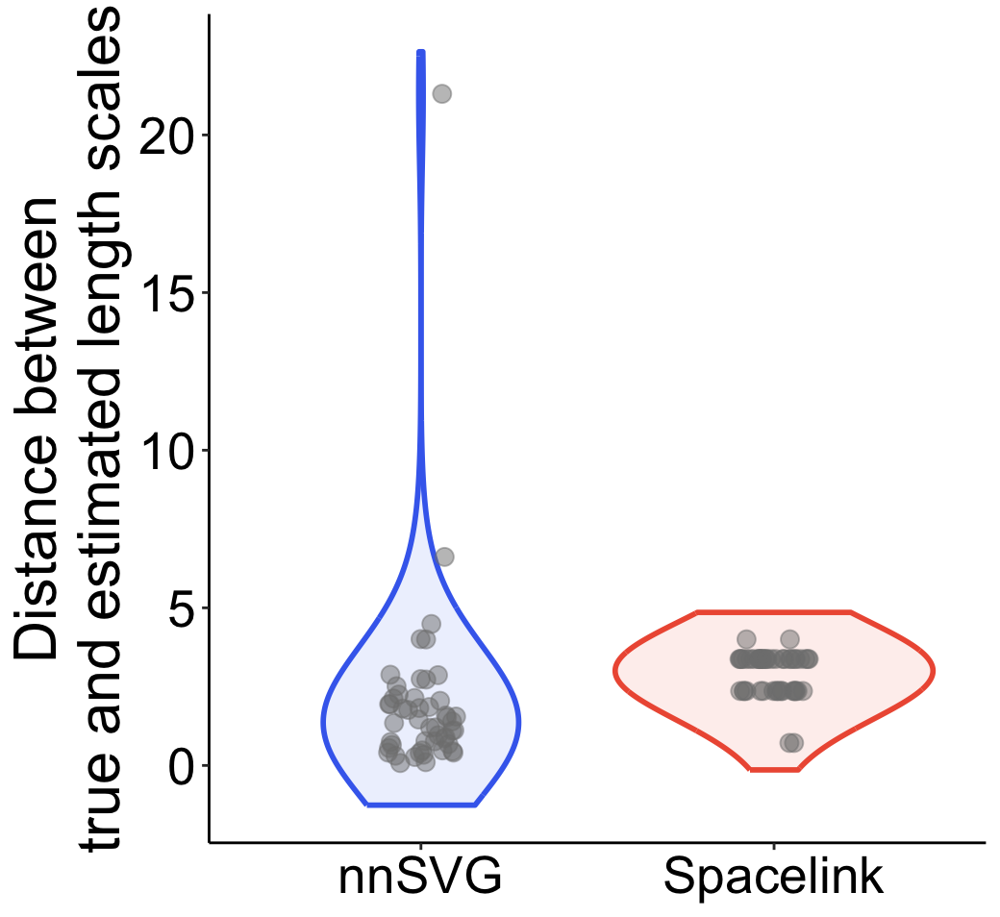
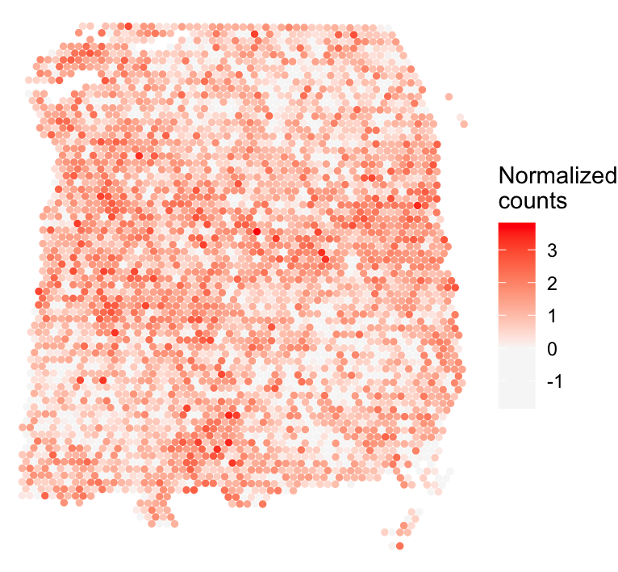

```{r, include = FALSE}
knitr::opts_chunk$set(
  collapse = TRUE,
  comment = "#>",
  fig.path = "figures/",
  out.width = "100%"
)
```

In this vignette, we compare the length-scale estimation performance of Spacelink against nnSVG. We simulated normal data from a simple Gaussian process model with a single spatial covariance kernel as follows:

$y \sim MVN(0, 0.5 \cdot (0.25 \cdot K_l + I)),$

where $K_l$ is an exponential covariance kernel with length scale $l$.

Since both nnSVG and Spacelink take normalized expression as input, we directly used the simulated normal data as input to both methods instead of simulating count data. 
Here, the true length scale is set to $5 \times \text{minimum distance}$.
To assess accuracy in length scale estimation, for nnSVG we computed $|l-\hat{l}|$ (the absolute difference between the true and estimated length scales), and for Spacelink we used the following absolute distance: 
$|l-\hat{l}_{i^*}|$, where $\hat{l}_{i^*}$ is the length scale corresponding to the largest estimated sigma.

```{r eval=FALSE}
library(MASS)
library(nnSVG)
library(spacelink)

data("Visium_human_DLPFC")
spatial_coords <- Visium_human_DLPFC$spatial_coords
range_all <- max(apply(spatial_coords, 2, function(col) diff(range(col))))
spatial_coords <- apply(spatial_coords, 2, function(col) (col - min(col)) / range_all)

D <- as.matrix(dist(spatial_coords)); N <- nrow(spatial_coords)
minD <- min(D[D!=0])

phi <- 1/(5*minD)
snr <- 0.25
tau <- 0.5

K <- exp(-phi*D); chol_K <- chol(K)

set.seed(123)
norm_expr <- matrix(1, 50, N) + sqrt(tau)*matrix(rnorm(50*N), 50, N) + sqrt(tau*snr)*mvrnorm(50, rep(0,N), K)

nnsvg_result <- nnSVG(norm_expr, spatial_coords)
spacelink_result <- spacelink(norm_expr, spatial_coords)

nnsvg_lengthscale_error <- abs(1/(nnsvg_result[,"phi"]) - 1/phi)/minD
spacelink_error <- abs(1/apply(spacelink_result, 1, function(x)x[paste0("phi",which.max(x[grepl("sigma",names(x))]))]) - 1/phi)/minD
```

The violin plot below shows the difference between the true and estimated length scales for Spacelink and nnSVG across data points.

```{r eval=FALSE}
df = data.frame(error = c(nnsvg_lengthscale_error, spacelink_error), method = rep(c("nnSVG","Spacelink"),each=50))
ggplot(df, aes(x = method, y = error, fill = method)) + 
  geom_violin(aes(color = method), alpha = 0.1, linewidth = 1, adjust = 5, trim = FALSE) + 
  scale_fill_manual(values = c("nnSVG" = "royalblue2","Spacelink" = "tomato2"), guide="none") + 
  scale_color_manual(values = c("nnSVG" = "royalblue2","Spacelink" = "tomato2"), guide="none") + 
  geom_jitter(aes(color = "black"), alpha = 0.5, position=position_jitter(0.1), size = 3) + 
  ylab("Distance between\ntrue and estimated length scales") + 
  theme_classic() + 
  theme(axis.title.x=element_blank(), axis.title.y=element_text(size=23), 
        axis.text=element_text(size=20, color="black"))
```

{#id .class width=50% height=50%}

While most cases have a difference of 5 or less, nnSVG shows error exceeding 20 in some case.
The data for the outlier case is shown below:

```{r eval=FALSE}
df <- as.data.frame(cbind(spatial_coords, expr = (norm_expr[nnsvg_lengthscale_error > 20,])))
colnames(df) <- c('X0', 'X1', 'expr')
print(ggplot(df, aes(x = X0, y = X1, color = expr)) +
        geom_point(size = 1) +
        theme_void() + scale_y_reverse() +
        scale_color_gradient2(low = "grey97",  mid = "grey97", high = "red", name = "Normalized\ncounts") +
        theme(plot.title = element_text(face = "italic", size = 16)))
```

{#id .class width=50% height=50%}