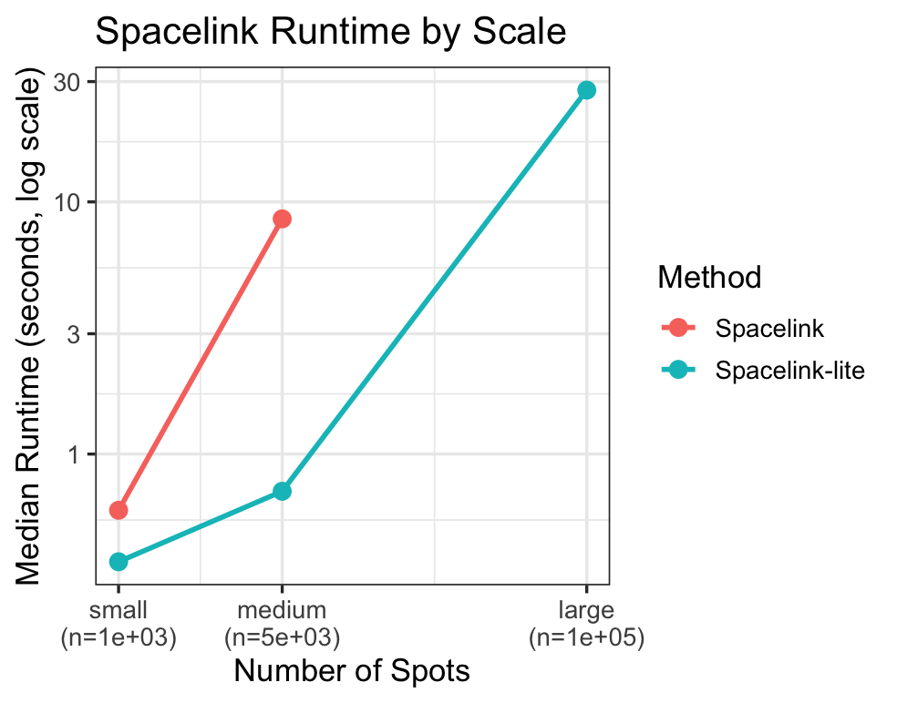
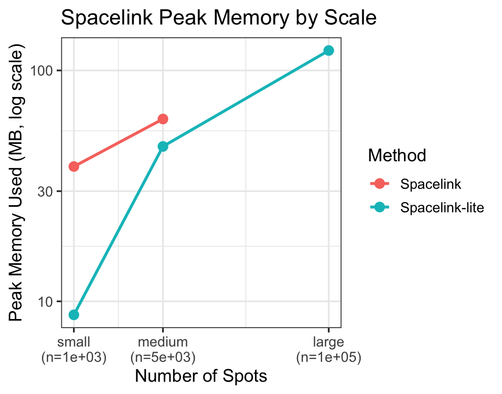

```{r, include = FALSE}
knitr::opts_chunk$set(
  collapse = TRUE,
  comment = "#>",
  fig.path = "figures/",
  out.width = "100%"
)
```

In this vignette, we demonstrate the runtime and memory usage of Spacelink and Spacelink-lite across simulation datasets of varying scales.

We consider three different scales: a small-scale dataset with 1,000 spots, a medium-scale dataset with 5,000 spots, and a large-scale dataset with 100,000 spots.

Since the primary goal is to compare runtime and memory usage, we generated data from a simple normal distribution to reduce simulation time.
The generated data are directly treated as normalized counts and used as input for Spacelink without additional preprocessing.

We measured runtime and peak memory usage using the [`peakRAM`](https://github.com/tpq/peakRAM) package. Each experiment was repeated 10 times, and the median runtime and median peak memory usage were reported.

For the large-scale dataset, the full (non-lite) version of Spacelink was not evaluated due to its prohibitive computational and memory requirements.


```{r eval=FALSE}
library(spacelink)
library(peakRAM)
library(dplyr)
library(ggplot2)

set.seed(123)
scales  <- c(small = 1000, medium = 5000, large = 100000)
coords_list <- list()
coords_list[['small']]  <- cbind(kronecker(rep(1,25), 1:40),  kronecker(1:25,  rep(1,40)))
coords_list[['medium']] <- cbind(kronecker(rep(1,50), 1:100), kronecker(1:50,  rep(1,100)))
coords_list[['large']]  <- cbind(kronecker(rep(1,250),1:400), kronecker(1:250, rep(1,400)))

n_iter <- 10

run_benchmark <- function(scale_name, method_name, lite_flag, n_iter) {
  n_spots <- scales[[scale_name]]
  coords  <- coords_list[[scale_name]]
  
  times   <- numeric(n_iter)
  peaks   <- numeric(n_iter)
  
  for (i in seq_len(n_iter)) {
    norm_data <- matrix(rnorm(n_spots), nrow = 1, ncol = n_spots)
    
    pr <- peakRAM(
      spacelink(
        normalized_counts = norm_data,
        spatial_coords    = coords,
        lite              = lite_flag
      )
    )
    
    times[i] <- pr$Elapsed_Time_sec
    peaks[i] <- pr$Peak_RAM_Used
  }
  
  data.frame(
    scale       = scale_name,
    n_spots     = n_spots,
    method      = method_name,
    time_s      = median(times),
    peak_mem = median(peaks)
  )
}

benchmark_results <- lapply(names(scales), function(scale_name) {
  cat("Benchmarking scale:", scale_name, "\n")
  
  if (scale_name == "large") {
    run_benchmark(scale_name, "spacelink_lite", lite_flag = TRUE,  n_iter = n_iter)
  } else {
    bind_rows(
      run_benchmark(scale_name, "spacelink_full", lite_flag = FALSE, n_iter = n_iter),
      run_benchmark(scale_name, "spacelink_lite", lite_flag = TRUE,  n_iter = n_iter)
    )
  }
})

bm_df <- bind_rows(benchmark_results) |>
  mutate(
    scale  = factor(scale, levels = names(scales)),
    method = recode_factor(method,
                           "spacelink_full" = "Spacelink",
                           "spacelink_lite" = "Spacelink-lite")
  )
```

The results are as follows.

```{r eval=FALSE}
# --- Plot: Runtime ---
p_time <- ggplot(bm_df, aes(x = n_spots, y = time_s, color = method, group = method)) +
  geom_line(linewidth = 1, na.rm = TRUE) +
  geom_point(size = 3) +
  scale_x_log10(
    breaks = scales,
    labels = paste0(names(scales), "\n(n=", format(scales, big.mark = ","), ")")
  ) +
  scale_y_log10() +
  labs(
    title = "Spacelink Runtime by Scale",
    x     = "Number of Spots",
    y     = "Median Runtime (seconds, log scale)",
    color = "Method"
  ) +
  theme_bw(base_size = 13)

# --- Plot: Peak Memory ---
p_mem <- ggplot(bm_df, aes(x = n_spots, y = peak_mem / (1024^2), color = method, group = method)) +
  geom_line(linewidth = 1, na.rm = TRUE) +
  geom_point(size = 3) +
  scale_x_log10(
    breaks = scales,
    labels = paste0(names(scales), "\n(n=", format(scales, big.mark = ","), ")")
  ) +
  scale_y_log10() +
  labs(
    title = "Spacelink Peak Memory by Scale",
    x     = "Number of Spots",
    y     = "Peak Memory Used (MB, log scale)",
    color = "Method"
  ) +
  theme_bw(base_size = 13)

print(p_time)
print(p_mem)
```

{#id .class width=50% height=50%}

{#id .class width=50% height=50%}